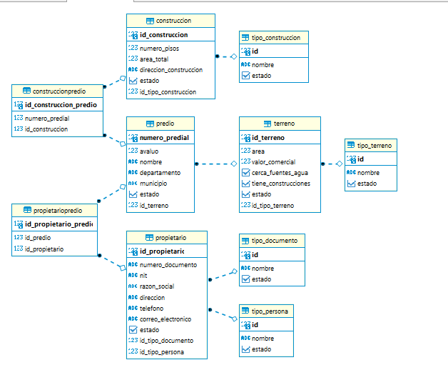
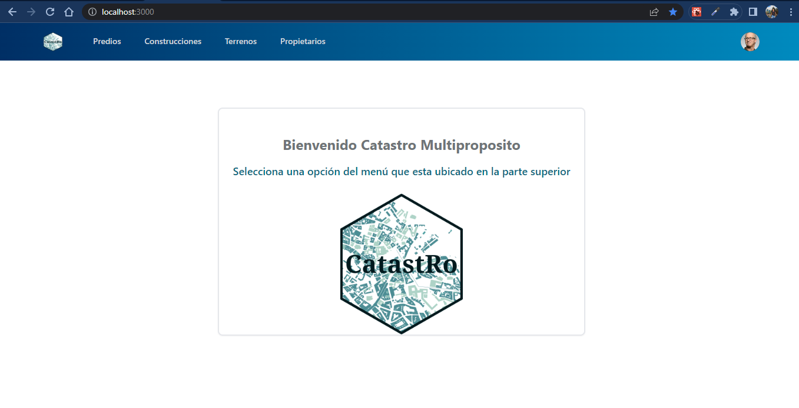
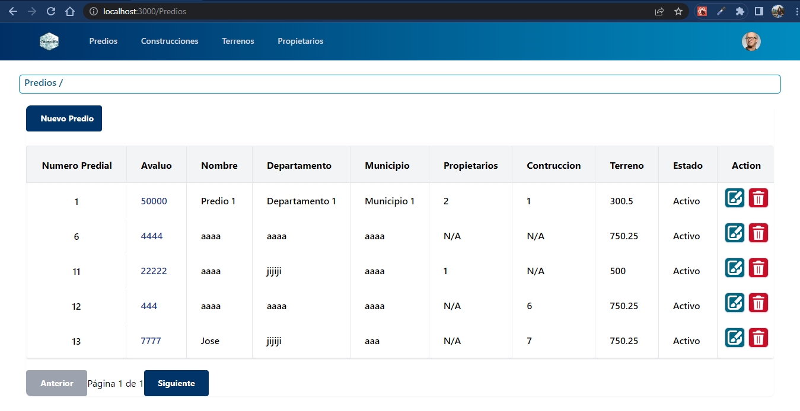

# crud_catastro
Crud para el registro de catastro de los municipios

En la raiz del proyecto el archivo 

catastro.sql 

contiene los scripts para ejecutar en la base de datos postgresql

debes asegurarte que el back ejecuta una base de datos procurar modificar esa ya que tiene los modelos 

Una vez ya has iniciado podras ver 

vista general de los predios 

